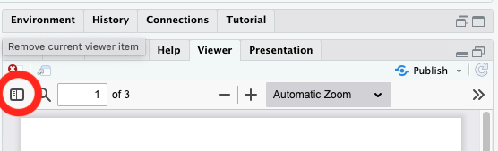

## Purpose

In this week's homework, you will apply concepts from Lab 12 (slopes and intercepts as outcomes) to a new dataset and research context.

This key uses the synthetic dataset **sleep_work.csv**, in which employees are nested within companies and the relationship between sleep and performance varies across companies.

## Load Packages

```{r load-packages, message=FALSE, echo=FALSE}
library(tidyverse)
```

# Research scenario

This dataset examines the relationship between **hours of sleep and cognitive performance** among employees working at different companies.

* Employees are nested within companies
* You will examine how **sleep duration** predicts **cognitive performance scores**
* You will also examine whether this relationship differs across companies

## Read in the Data

The dataset is called `sleep_work.csv`.

Variables:

* `company_id`: company identifier
* `performance`: cognitive performance score
* `sleep_hours`: hours of sleep per night
* `company_size`: number of employees at the company (group-level variable)

Read in the dataset, call it `sleep`. Make sure that `company_id` is a factor.

```{r read-data, echo=FALSE, message=FALSE}
sleep <- read_csv("data/sleep_work.csv")

sleep <- sleep %>%
  mutate(company_id = as.factor(company_id))

```

## Q1: What is the clustering structure in this dataset? Why might this matter?

[Insert answer here.]

## Q2: Run a disaggregated model predicting `performance` from `sleep_hours`.

```{r disagg, eval=FALSE, echo=FALSE}

disag <- lm(performance ~ sleep_hours, data = sleep)
summary(disag)

```

## Q3: Interpret the slope from this model. Is it significant?

[Insert answer here.]

## Q4: What assumption about clustering / independence does this model make?

[Insert answer here.]

## Q5: Create an aggregated dataset at the company level (e.g., average `peformance` and average `sleep_hours` for each company).

```{r aggregate, eval=FALSE, echo=FALSE}
sleep_agg <- sleep %>%
  group_by(company_id) %>%
  summarise(perf_mean = mean(performance, na.rm=TRUE),
            sleep_mean = mean(sleep_hours, na.rm=TRUE))
```

## Q6: Run the aggregated model.

```{r agg-model, eval=FALSE, echo=FALSE}
agg <- lm(perf_mean ~ sleep_mean, data = sleep_agg)
summary(agg)
```

## Q7: Interpret the slope from this model. Is it significant?

[Insert answer here.]

## Q8: What is the key difference between the aggregated and disaggregated models in how they treat within-company vs. between-company variability?

[Insert answer here.] 

## Q9: Calculate the ICC using a one-way ANOVA approach (as we did in lab).

```{r icc, eval=FALSE, echo=FALSE}
icc_mod <- lm(performance ~ company_id, data = sleep)
icc_aov <- anova(icc_mod)

ss_b <- icc_aov[1,2]
ss_t <- icc_aov[1,2] + icc_aov[2,2]
ICC <- ss_b / ss_t
ICC
```

## Q10: Interpret the ICC.

[Insert answer here.]

## Q11: Visualize whether slopes and intercepts differ across companies.

```{r viz, eval=FALSE, echo=FALSE}
sleep %>%
  ggplot(aes(x = sleep_hours, y = performance, color = company_id)) +
  geom_point() +
  geom_smooth(method = "lm", se = FALSE)
```

## Q12: Based on the plot, do slopes, intercepts, or both vary?

[Insert answer here.]

## Q13: Fit a model including `company_id` as a predictor.

```{r model1, eval=FALSE, echo=FALSE}
model1 <- lm(performance ~ sleep_hours + company_id, data = sleep)
summary(model1)
anova(model1)
```

## Q14: What does this model tell you about the effect of company?

[Insert answer here.]

## Q15: Fit a model with an interaction.

```{r model2, eval=FALSE, echo=FALSE}
model2 <- lm(performance ~ sleep_hours * company_id, data = sleep)
summary(model2)
anova(model2)
```

## Q16: What does this model tell you about slope differences?

[Insert answer here.]

## Q17: Extract slopes and intercepts for each company. Make sure this dataset still includes the `company_size` variable. 

```{r slopes, eval=FALSE, echo=FALSE}
slopesints <- sleep %>%
  group_by(company_id, company_size) %>%
  summarise(
    intercept = coef(lm(performance ~ sleep_hours))[1],
    slope = coef(lm(performance ~ sleep_hours))[2]
  )

```

## Q18: Predict the intercepts from `company_size`.

```{r intercept-model, eval=FALSE, echo=FALSE}

int_mod <- lm(intercept ~ company_size, data = slopesints)
summary(int_mod)

```

## Q19: What do the results of this model tell you?

[Insert answer here.]

## Q20: Now predict slopes from `company_size`.

```{r slope-model, eval=FALSE, echo=FALSE}

slope_mod <- lm(slope ~ company_size, data = slopesints)
summary(slope_mod)

```

## Q22: What do the results of this model tell you?

[Insert answer here.]

---

## Render and submit your document

**Make sure that you I can see all of your answers in the rendered document!**

To receive credit for this homework, submit a rendered PDF version of your file to "Module 12: Homework Submission" on Canvas.

-   At the top of the .qmd file, change "format: html" to "format: pdf"
-   Click "Render" at the top of the document
-   Your document will open in a browser tab
    -   If your document opens in the "Viewer" pane, click the "sidebar" button (circled in image below).
    -   If you get a popup warning, click "Try Again" (may be specific to Mac)



-   Click the "Save" icon on the top right (circled in the image below)


-   Save wherever you keep your class documents and upload your file to Canvas

------------------------------------------------------------------------
